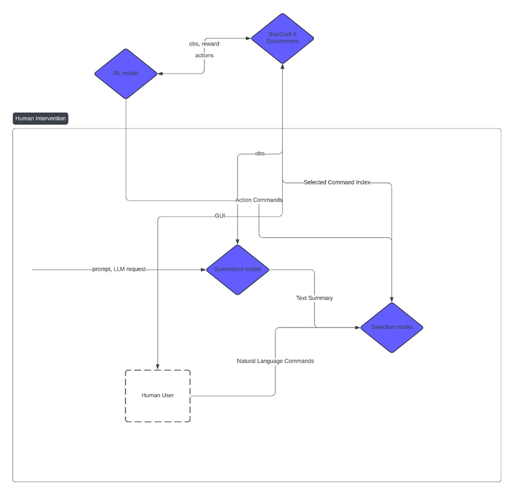

# 用语言来游戏——基于LLM和pysc2的策略生成

## Overview

该项目是基于DI-star和ChatGPT的策略模型，你可以使用自然语言来操控模型进行星际争霸二的zvz游戏！


## Usage

### 配置 DI-star和星际争霸二

按照DI-star文档中进行配置即可

### 配置环境

```shell
    cd di-star
    pip install -e .
```

然后单独安装OPENAI和pytorch

```shell
pip install pytorch torchvision torchaudio 
pip install openai
```

### 获取和设置OpenAI api

在<https://openai.com/>获得api
setx OPENAI_API_KEY "your_api_key_here"
或者在环境变量中设置OPENAI_API_KEY
(Future：更新其他大模型的版本)

### run

```shell
python distar/bin/play_llm.py
```
